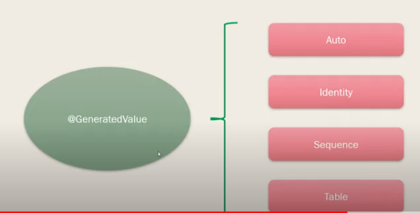

# Hibernate

- Campos Clave
    - Generación de campos claves por hibernate
      
## Consulta de tipo select

    HQL: Es el lenguaje de consulta de Hibernate 
[Manual de Hibernate](https://docs.jboss.org/hibernate/orm/3.6/reference/es-ES/pdf/hibernate_reference.pdf)
